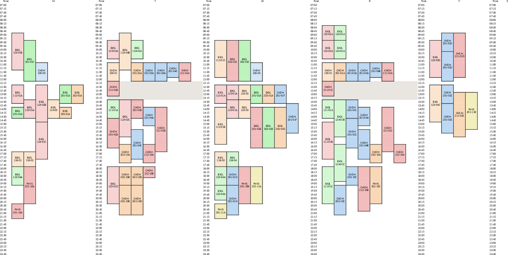

# Course Schedule Email Reporter

Generates color-coded Excel schedule-grid workbooks from Roosevelt Banner Course Finder HTML; lays course sections on 15-minute time slots with subject and level colors; sends enrollment-change reports by email on a repeating schedule.

## Quick start

Build the merged term schedule-grid workbook from live course HTML:

```bash
./build_grids_from_html.py -t 202710
```

Pass `--subject SUBJ` (repeatable) to change which subjects are fetched; the default set is `BIOL PHYS CHEM BCHM`. For the email change-detection path and CSV-based grids, see [docs/USAGE.md](docs/USAGE.md).

## Documentation

- [docs/INSTALL.md](docs/INSTALL.md): prerequisites, dependencies, and setup steps.
- [docs/USAGE.md](docs/USAGE.md): CLI flags, workflows, output locations, and color scheme.
- [docs/CODE_ARCHITECTURE.md](docs/CODE_ARCHITECTURE.md): system design, major components, and data flow.
- [docs/FILE_STRUCTURE.md](docs/FILE_STRUCTURE.md): directory map and where to add new work.
- [docs/AUTHORS.md](docs/AUTHORS.md): project maintainers and contributors.
- [docs/CHANGELOG.md](docs/CHANGELOG.md): chronological record of changes.

<!-- screenshots:begin (managed by screenshot-docs) -->

<!-- screenshots:end -->
