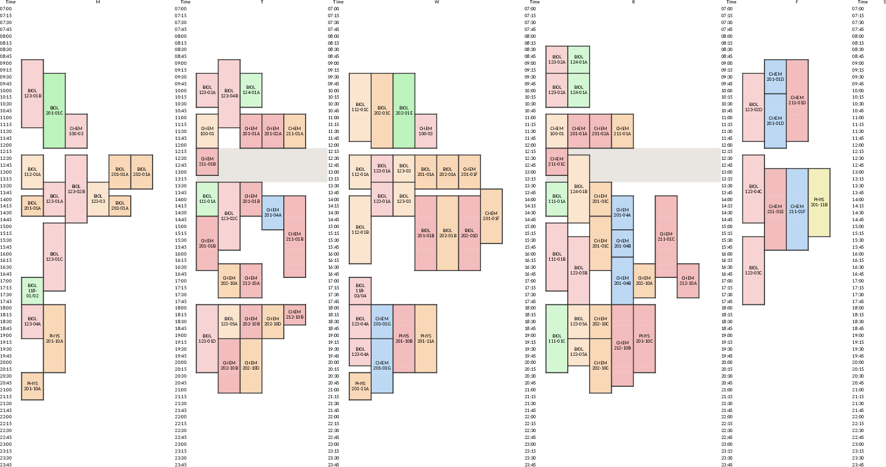

# Course Schedule Email Reporter

Build color-coded Excel course grids from Banner listings and monitor enrollment
changes by email. It helps Roosevelt schedule planning turn term data into a
time-slot workbook and focused reports.

## Planning workbook

For a term and subject set, the primary workflow downloads the Banner results,
lays sections across 15-minute weekday slots, and writes one merged `.xlsx`
workbook. It gives a scheduler a visual answer to questions such as "what meets
when?" while retaining raw parsed data and analysis tabs for follow-up work.

- Produces one merged workbook with nine preset views, including lower-level,
  graduate, Schaumburg, lab, all-course, and raw-data views.
- Uses subject and course-level colors, with enrollment pressure and waitlist or
  closed status called out in the grid.
- Supports a CSV-only route for draft schedules when downloading live course
  HTML is not the right input.
- Detects meaningful enrollment and section changes between snapshots, so the
  report path avoids sending mail for a no-change run.

## Term build output

The final line of the HTML builder is the merged workbook path, such as
`output/202710_schedule_grid-YYYY_MM_DD.xlsx`. Its tabs share the same 15-minute
grid: concurrent sections receive side-by-side columns, and each meeting cell
spans its scheduled duration. The HTML workflow also writes common-hour and
non-standard-timeblock analysis workbooks beside the merged file.

<!-- screenshots:begin (managed by screenshot-docs) -->

<!-- screenshots:end -->

## Before you start

The primary workbook builder needs Python 3.12 and access to the live Roosevelt
Banner Course Finder. The email workflow is separate and macOS-only: it uses
Mail.app, tmux, Xcode or Command Line Tools, and Automation permission for the
locally built `CourseFinderMailer.app`. Linux and Windows do not support the
email path.

## Quick start: build a term workbook

From a clone on macOS with Homebrew Python 3.12, install the declared
dependencies and build the default science-subject workbook:

```bash
brew bundle
python3 -m pip install -r pip_requirements.txt
source source_me.sh && python3 build_grids_from_html.py -t 202710
```

The command fetches the default `BIOL`, `PHYS`, `CHEM`, and `BCHM` results, then
prints the path to the completed merged `.xlsx` workbook under `output/`. Use a
current six-digit Banner term code in place of `202710`.
[docs/INSTALL.md](docs/INSTALL.md) covers setup and its email-specific
prerequisites.

## Representative usage

Build the same nine-view term workbook for an explicit subject selection:

```bash
source source_me.sh && python3 build_grids_from_html.py \
    -t 202710 --subject MATH --subject PSYC
```

Each `--subject` flag replaces the default science set rather than adding to it.
For a draft-schedule CSV that should not contact Banner, use the dedicated
builder with an explicit output name:

```bash
source source_me.sh && python3 tools/build_grid_from_csv.py \
    -i data/spring_2027_courses.csv --biol --chicago -n 100 -n 200 \
    -o biol_lower_division_chicago.xlsx
```

That route requires `Meeting_Days`, `Begin_Time`, and `End_Time` columns; it
writes one filtered grid workbook. [docs/USAGE.md](docs/USAGE.md) documents
filters, expected sheets, output behavior, dry-run reporting, and the full
workflow set.

## Enrollment-change email daemon

Only use this macOS path after completing the prerequisites above and confirming
that Mail.app has a configured account. Building or rebuilding the helper can
require a fresh Automation approval; the permission test and each new daemon
launch send a real test message before the scheduler starts.

```bash
./build_course_finder_mailer.sh
source source_me.sh && python3 test_email_permission.py
./run_email_tmux.sh
```

The running scheduler is visible as the `cfmail` tmux session. It stops instead
of scheduling when its Mail permission test fails, which makes an unapproved or
unavailable Mail setup visible before recurring reports run.

## Documentation

- [docs/INSTALL.md](docs/INSTALL.md) - system requirements, dependency setup,
  and Mail helper installation.
- [docs/USAGE.md](docs/USAGE.md) - HTML, CSV, dry-run, baseline, and tmux daemon
  workflows.
- [docs/FILE_FORMATS.md](docs/FILE_FORMATS.md) - required CSV columns, workbook
  tabs, generated files, and cache formats.
- [docs/TROUBLESHOOTING.md](docs/TROUBLESHOOTING.md) - Banner failures, empty
  grids, Mail permission, and environment recovery.
- [docs/CODE_ARCHITECTURE.md](docs/CODE_ARCHITECTURE.md) - component
  responsibilities and the build/report data flow.
- [docs/FILE_STRUCTURE.md](docs/FILE_STRUCTURE.md) - repository map and the
  right home for source, output, and tooling changes.

## Current scope

Banner parsing depends on the Course Finder page structure, so markup changes
can require parser updates. Generated `cache/`, `logs/`, and `output/` data are
runtime state rather than source artifacts; retain the workbook you need outside
a disposable checkout.
